# Bootstrap & LESS (RIA) Seminar

Inhalt
<!-- vscode-markdown-toc -->
* 1. [Ausführung und Installation mittels Visual Studio Code](#AusfhrungundInstallationmittelsVisualStudioCode)
	* 1.1. [Visual Studio Code](#VisualStudioCode)
	* 1.2. [Hilfsfunktionen für VS Code](#HilfsfunktionenfrVSCode)
	* 1.3. [Extensions für VS Code](#ExtensionsfrVSCode)
	* 1.4. [Emmet Cheatsheets](#EmmetCheatsheets)
	* 1.5. [Bilder/Gifs von Webseiten aufnehmen](#BilderGifsvonWebseitenaufnehmen)
	* 1.6. [LESS Installation](#LESSInstallation)
	* 1.7. [Bootstrap Installation](#BootstrapInstallation)
		* 1.7.1. [jQuery Installation](#jQueryInstallation)
* 2. [LESS](#LESS)
	* 2.1. [Variablen](#Variablen)
		* 2.1.1. [Beispiele mit Variablen](#BeispielemitVariablen)
	* 2.2. [Mixins](#Mixins)
		* 2.2.1. [Beispiel Mixin Varianten (Normal/Parametermixins)](#BeispielMixinVariantenNormalParametermixins)
	* 2.3. [Hierarchien](#Hierarchien)
		* 2.3.1. [Beispiel Hierarchien](#BeispielHierarchien)
		* 2.3.2. [Beispiel Hierarchien & Module](#BeispielHierarchienModule)
	* 2.4. [Module](#Module)
		* 2.4.1. [Beispiel Module](#BeispielModule)
		* 2.4.2. [Beispiel Styles und Module](#BeispielStylesundModule)
	* 2.5. [Gridsystem](#Gridsystem)
		* 2.5.1. [Beispiel Gridsystem](#BeispielGridsystem)
	* 2.6. [Responsive CSS](#ResponsiveCSS)
		* 2.6.1. [Beispiel Responsive CSS](#BeispielResponsiveCSS)
	* 2.7. [Importe](#Importe)
		* 2.7.1. [Beispiel Importe](#BeispielImporte)
* 3. [Bootstrap](#Bootstrap)
	* 3.1. [Modulares CSS](#ModularesCSS)
		* 3.1.1. [Beispiele classes und ids](#Beispieleclassesundids)
		* 3.1.2. [Beispiel only classes](#Beispielonlyclasses)
	* 3.2. [Nutzung](#Nutzung)
	* 3.3. [Grundlagen](#Grundlagen)
	* 3.4. [Tabellen](#Tabellen)
	* 3.5. [Utilities](#Utilities)
	* 3.6. [Grids](#Grids)
		* 3.6.1. [Beispiel Grids](#BeispielGrids)
		* 3.6.2. [Beispiel Offsets](#BeispielOffsets)
		* 3.6.3. [Beispiel Push & Pull](#BeispielPushPull)
		* 3.6.4. [Beispiel Zeigen und Verstecken](#BeispielZeigenundVerstecken)
	* 3.7. [Panels](#Panels)
	* 3.8. [Buttons & Formulare](#ButtonsFormulare)
	* 3.9. [Formulare](#Formulare)
	* 3.10. [Navigationen](#Navigationen)
	* 3.11. [Collapsible](#Collapsible)

<!-- vscode-markdown-toc-config
	numbering=true
	autoSave=true
	/vscode-markdown-toc-config -->
<!-- /vscode-markdown-toc -->

##  1. <a name='AusfhrungundInstallationmittelsVisualStudioCode'></a>Ausführung und Installation mittels Visual Studio Code

###  1.1. <a name='VisualStudioCode'></a>Visual Studio Code 
- Live Server als Extension installieren ** mit ALT + L + O wird der Server gestartet und die aktuelle Webseite geöffnet und bei jedem Speichern aktualisiert im Browser
- Formatierung des Texts mit ALT + Shift + F
- Zeilenumbruch aktivieren mit ALT + Z
- Aus-/Einkommentieren mit STRG + #
- Kommentar in JavaScript /**/ (Ein-/Mehrzeilig) oder // (Einzeilig)

###  1.2. <a name='HilfsfunktionenfrVSCode'></a>Hilfsfunktionen für VS Code
- https://code.visualstudio.com/docs/getstarted/tips-and-tricks
- https://code.visualstudio.com/shortcuts/keyboard-shortcuts-windows.pdf
- https://code.visualstudio.com/docs/getstarted/keybindings
- Aufruf durch F1
    - Wenn > hinterlegt ist, werden Funktionen aufgeführt
    - Ohne > kann man nach Dateien suchen
- STRG + B für Explorer links zuklappen

###  1.3. <a name='ExtensionsfrVSCode'></a>Extensions für VS Code
Installationen durchführen für folgende Extensions:
- Debugger for Chrome
- npm
- Material Icon Theme
- CSS Formatter
- Stylesheet Formatter
- Beautify css/sass/scss/less
- Easy LESS
    - "Compile-on-save" for LESS stylesheets without using a build task.
- Deutsches Studio falls gewünscht
    - German Language Pack for Visual Studio Code
    - sonst ist Englisch der empfohlene Standard
        - über F1 kann mittels "> Configure Display Language" die Spracheinstellung geändert werden
- Über Datei bzw. File, Automatische Speichern/Autosave aktivieren
- Markdown Tools
    - Markdown TOC von Jeffrey Kern
    - Ausführen mit STRG + SHIFT + P
        - Eingabe von "Generate TOC for markdown" + ENTER
    - Markdown Preview Github Styling
    - Paste Image (Bilder direkt einfügen in .md)

###  1.4. <a name='EmmetCheatsheets'></a>Emmet Cheatsheets
- https://docs.emmet.io/cheat-sheet/

###  1.5. <a name='BilderGifsvonWebseitenaufnehmen'></a>Bilder/Gifs von Webseiten aufnehmen 
- Screenshots der Webseite - FireShot
  - https://chrome.google.com/webstore/detail/take-webpage-screenshots/mcbpblocgmgfnpjjppndjkmgjaogfceg?hl=de
- How to add GIFs to your GitHub README
  - https://medium.com/@josephcardillo/how-to-add-gifs-to-your-github-readme-89c74da2ce47
- markdown-magic-local-image
    - https://github.com/stevenbenisek/markdown-magic-local-image

###  1.6. <a name='LESSInstallation'></a>LESS Installation
Eingabe im Terminal

Installation: 
```html
npm install -g less --save-dev
```
Abfrage der Version: 
```html
lessc --version
```
.less zu .css wandeln
```html
lessc variablen.less variablen.css
```

###  1.7. <a name='BootstrapInstallation'></a>Bootstrap Installation
Anleitung im Web:
- https://getbootstrap.com/docs/4.1/getting-started/download/

Eingabe im Terminal

Vorbereitung: 
```html
npm --version
npm init
```
alles mit Enter bestätigen (Außer Angaben sind gewünscht)  

Installation: 
```html
npm install bootstrap@3.3.7
```

Ergebnis:
```html
npm notice created a lockfile as package-lock.json. You should commit this file.
npm WARN bootstrap1@1.0.0 No description
npm WARN bootstrap1@1.0.0 No repository field.

+ bootstrap@3.3.7
added 1 package from 1 contributor and audited 1 package in 1.467s
found 0 vulnerabilities
```

####  1.7.1. <a name='jQueryInstallation'></a>jQuery Installation
Vorbereitung: 
```html
npm view jquery versions
```

Installation: 
```html
npm install jquery @2.2.4
```

Ergebnis:
```html
npm WARN bootstrap1@1.0.0 No description
npm WARN bootstrap1@1.0.0 No repository field.

+ jquery@2.2.4
added 1 package from 1 contributor and audited 2 packages in 1.565s
found 1 high severity vulnerability
  run `npm audit fix` to fix them, or `npm audit` for details
```

##  2. <a name='LESS'></a>LESS
- Alex Sellier (Urheber)
- CSS Präprozessor
- Superset von CSS (.CSS kann zu .Less-Datei gemacht werden)
- lesscss.org

Eigenschaften:
- Variablen
- Mixins
- Hierachien
- Module
- Gridsystem
- Responsive CSS
- Importe
- Funktionen
- Extensions
- Mediaqueries

Nutzung des Farbrads mit Komplentärfarben für Farbharmonien

###  2.1. <a name='Variablen'></a>Variablen
- http://lesscss.org/features/#variables-feature

####  2.1.1. <a name='BeispielemitVariablen'></a>Beispiele mit Variablen
LESS-Datei
```less
@basisfarbe: #999;

@defaultfarbe: @basisfarbe;
@warnfarbe: red;

@komplement: spin(@warnfarbe, 180);

@successfarbe: rgb(46, 194, 125);
@infofarbe: blue;

@defaultTextFarbe: darken(@defaultfarbe, 10%);
@defaultBorderFarbe: darken(@defaultfarbe, 10%);
@defaultBgFarbe: darken(@defaultfarbe, 30%);

@warnTextFarbe: darken(@warnfarbe, 10%);
@warnBorderFarbe: darken(@warnfarbe, 10%);
@warnBgFarbe: lighten(@warnfarbe, 30%);

@basislaenge: 10px;
@standardpadding: @basislaenge @basislaenge @basislaenge*2 @basislaenge*2;
@standarmargin : @basislaenge*2;

h1 {
    color: @defaultTextFarbe;
    border: 1px solid @defaultBorderFarbe;
    background-color: @defaultBgFarbe; 
    
    // Kommentare mit // werden nicht nach .css kompiliert
    // color: darken(@basisfarbe, 10%);
    // border: 1px solid darken(@basisfarbe, 10%);
    // background-color: lighten(@basisfarbe, 30%);
    padding: @standardpadding;
    margin: @standarmargin;
}

p {
    color: @defaultTextFarbe;
    border: 1px solid @defaultBorderFarbe;
    background-color: @defaultBgFarbe; 
    
    // Kommentare mit /**/ werden nach .css kompiliert
    /* 
    color: darken(@basisfarbe, 10%);
    border: 1px solid @basisfarbe;
    background-color: lighten(@basisfarbe, 30%);
    */
    padding: @standardpadding;
    margin: @standarmargin;
}

p.warning {
    color: @warnTextFarbe;
    border: 1px solid @warnBorderFarbe;
    background-color: @warnBgFarbe;
}

p.komplement{
    color: @komplement;
}
```
Konvertierte CSS-Datei
```css
h1 {
  color: #808080;
  border: 1px solid #808080;
  background-color: #4d4d4d;
  padding: 10px 10px 20px 20px;
  margin: 20px;
}
p {
  color: #808080;
  border: 1px solid #808080;
  background-color: #4d4d4d;
  /* 
    color: darken(@basisfarbe, 10%);
    border: 1px solid @basisfarbe;
    background-color: lighten(@basisfarbe, 30%);
    */
  padding: 10px 10px 20px 20px;
  margin: 20px;
}
p.warning {
  color: #cc0000;
  border: 1px solid #cc0000;
  background-color: #ff9999;
}
p.komplement {
  color: #00ffff;
}
```
Zugehörige Anzeige in html
```html
<!DOCTYPE html>
<html lang="en">

<head>
    <meta charset="UTF-8">
    <meta name="viewport" content="width=device-width, initial-scale=1.0">
    <meta http-equiv="X-UA-Compatible" content="ie=edge">
    <title>Variablen in LESS</title>
    <link rel="stylesheet" href="variablen.css">
</head>

<body>
    <h1>Variablen in LESS</h1>
    <p>Lorem ipsum dolor sit amet consectetur adipisicing elit.
        Quis, pariatur aspernatur velit quidem voluptate illum.
    </p>
    <p class="warning">Lorem ipsum dolor sit amet consectetur adipisicing elit.</p>
</body>
</html>
```

###  2.2. <a name='Mixins'></a>Mixins
- http://lesscss.org/features/#mixins-feature
- http://lesscss.org/features/#mixins-feature-selectors-in-mixins
- http://lesscss.org/features/#mixins-feature-not-outputting-the-mixin

####  2.2.1. <a name='BeispielMixinVariantenNormalParametermixins'></a>Beispiel Mixin Varianten (Normal/Parametermixins)

```less
// Wir betrachten Mixins...
// ein Mixin kann aussehen wie...
// eine Klasse:
.btnprops {
    padding: 20px;
    border-radius: 5px;
    text-align: center;
    font-weight: bold;
    text-transform: uppercase;
}

// ein ID-Selektor (ungebräuchlich)
// hier als Param-mixin
// Durch () wird die Klasse im .css nicht mehr ausgegeben
#btnprops2() {
    padding: 20px;
    border-radius: 5px;
    text-align: center;
    font-weight: bold;
    text-transform: uppercase;
}

// Es gibt auch "Parametermixins":
// Durch () wird die Klasse im .css nicht mehr ausgegeben
.btnfarben() {
    color: black;
    border: 1px solid #000;
    background-color: lightgrey;
}

.btnfarbenMitParam(@color) {
    color: @color;
    border: 1px solid @color;
    background-color: lighten(@color, 30%);
}

//Mit Defaultparameter
.btnfarbenMitDefault(@color: black) {
    color: @color;
    border: 1px solid @color;
    background-color: lighten(@color, 50%);
}

//Aufruf eines Parametermixins mit Defaultparameter
.btn {
    // Mixin verwenden:
    .btnprops;
    .btnfarbenMitDefault;
}

.btn:hover {
    background-color: #ddd;
}

//Aufruf eines Parametermixins
.blue-btn {
    #btnprops2;
    .btnfarbenMitParam(blue);
}

//Aufruf eines Parametermixins
.red-btn {
    .btnfarbenMitParam(red);
    .btnprops;
}
```
Konvertierte css aus less
```css
.btnprops {
  padding: 20px;
  border-radius: 5px;
  text-align: center;
  font-weight: bold;
  text-transform: uppercase;
}
.btn {
  padding: 20px;
  border-radius: 5px;
  text-align: center;
  font-weight: bold;
  text-transform: uppercase;
  color: black;
  border: 1px solid black;
  background-color: #808080;
}
.btn:hover {
  background-color: #ddd;
}
.blue-btn {
  padding: 20px;
  border-radius: 5px;
  text-align: center;
  font-weight: bold;
  text-transform: uppercase;
  color: blue;
  border: 1px solid blue;
  background-color: #9999ff;
}
.red-btn {
  color: red;
  border: 1px solid red;
  background-color: #ff9999;
  padding: 20px;
  border-radius: 5px;
  text-align: center;
  font-weight: bold;
  text-transform: uppercase;
}
```
Zugehörige Anzeige in html
```html
<!DOCTYPE html>
<html lang="en">

<head>
    <meta charset="UTF-8">
    <meta name="viewport" content="width=device-width, initial-scale=1.0">
    <meta http-equiv="X-UA-Compatible" content="ie=edge">
    <title>Less: Mixins</title>
    <link rel="stylesheet" href="mixins.css">
</head>

<body>
    <h1>Mixins</h1>
    <p>
        <button class="btn">Standardbutton</button>
        <button class="blue-btn">Blauer Button</button>
        <button class="red-btn">Roter Button</button>
    </p>
</body>

</html>
```

###  2.3. <a name='Hierarchien'></a>Hierarchien
- Hierarchische Menüstruktur (Hierarchie)
    - z.B. Menu Parentselektor
- https://css-tricks.com/strategies-keeping-css-specificity-low/
- http://lesscss.org/features/#parent-selectors-feature

####  2.3.1. <a name='BeispielHierarchien'></a>Beispiel Hierarchien
```less
div#navigation {
    width: 170px;
    ul {
        margin: 0;
        padding: 0;
        list-style: none;
        li {
            margin-bottom: 5px;
            a {
                padding: 10px;
                display: block;
                background-color: #ddd;
                text-decoration: none;
                color: #000;
                text-align: center;
                font-weight: bold; // Parent-Selektor &
                &:hover {
                    background-color: #eee;
                } 
                // NIMM :hover
                // schreibe davor: div#navigation ul li  a
                // daher &:hover wird zu:
                // div#navigation ul li a:hover
            } 
            // so ginge es (ist aber nicht so gut):
            // a:hover {
            //     background-color: #eee;
            // }
        }
    }
}
```
Konvertierte css aus less
```css
div#navigation {
    width: 170px;
}

div#navigation ul {
    margin: 0;
    padding: 0;
    list-style: none;
}

div#navigation ul li {
    margin-bottom: 5px;
}

div#navigation ul li a {
    padding: 10px;
    display: block;
    background-color: #ddd;
    text-decoration: none;
    color: #000;
    text-align: center;
    font-weight: bold;
}

div#navigation ul li a:hover {
    background-color: #eee;
}
```
Zugehörige Anzeige in html
```html
<!DOCTYPE html>
<html lang="en">

<head>
    <meta charset="UTF-8">
    <meta name="viewport" content="width=device-width, initial-scale=1.0">
    <meta http-equiv="X-UA-Compatible" content="ie=edge">
    <title>Less: Hierarchische Strukturen</title>
    <link rel="stylesheet" href="hierarchisch01.css">
</head>

<body>
    <div id="navigation">
        <!-- ul>li*5>a{Beispielmenü $} -->
        <ul>
            <li><a href="#">Beispielmenü 1</a></li>
            <li><a href="#">Beispielmenü 2</a></li>
            <li><a href="#">Beispielmenü 3</a></li>
            <li><a href="#">Beispielmenü 4</a></li>
            <li><a href="#">Beispielmenü 5</a></li>
        </ul>
    </div>
</body>

</html>
```

####  2.3.2. <a name='BeispielHierarchienModule'></a>Beispiel Hierarchien & Module
```less
// ein Textmodul (oder so)
.text {
    color: black;
    padding: 5px;
    
    &:hover {
        color: red;
    }

    &.active {
        background-color: lightblue;
    } 
    
    // Modifier
    &-info {
        color: green;
        background-color: lightgreen;
    } 
    
    // Element
    &_header {
        font-weight: bold;
    }

    & span {
        color: purple;
    } 
    // im Content soll das anders aussehen
    .content & {
        color: blue
    }
}

// .content .text {
//     color:blue
// }
```
Konvertierte css aus less
```css
.text {
    color: black;
    padding: 5px;
}

.text:hover {
    color: red;
}

.text.active {
    background-color: lightblue;
}

.text-info {
    color: green;
    background-color: lightgreen;
}

.text_header {
    font-weight: bold;
}

.text span {
    color: purple;
}

.content .text {
    color: blue;
}
```

###  2.4. <a name='Module'></a>Module
- https://css-tricks.com/css-modules-part-1-need/
- Beispiel mit Buttons

####  2.4.1. <a name='BeispielModule'></a>Beispiel Module
```less
// Variablen
@default: #aaa;
@warnung: rgb(180, 39, 39);
@info: rgb(34, 122, 34);
@success: rgb(62, 62, 182);

// Mixins
.btnBasis() {
    padding: 10px;
    border: none;
    outline: none;
}

.btnAusA() {
    text-decoration: none;
    display: inline-block;
    font-family: verdana;
    font-size: 1em;
}

.btnColor(@color) {
    color: darken(@color, 20%);
    background-color: lighten(@color, 10%);
    
    // Hierarchie geht auch im Mixin:
    &:hover {
        background-color: lighten(@color, 20%);
    }
}

// Button Modul
.btn {
    .btnBasis();
    .btnAusA(); 
    
    // Varianten:
    &-default {
        .btnColor(@default);
    }
    &-warnung {
        .btnColor(@warnung);
    }
    &-info {
        .btnColor(@info);
    }
    &-success {
        .btnColor(@success);
    }
}
```
Konvertierte css aus less
```css
.btn {
    padding: 10px;
    border: none;
    outline: none;
    text-decoration: none;
    display: inline-block;
    font-family: verdana;
    font-size: 1em;
}

.btn-default {
    color: #777777;
    background-color: #c3c3c3;
}

.btn-default:hover {
    background-color: #dddddd;
}

.btn-warnung {
    color: #601515;
    background-color: #d43a3a;
}

.btn-warnung:hover {
    background-color: #dd6464;
}

.btn-info {
    color: #0c2a0c;
    background-color: #2da22d;
}

.btn-info:hover {
    background-color: #3ac83a;
}

.btn-success {
    color: #24246a;
    background-color: #5f5fc8;
}

.btn-success:hover {
    background-color: #8585d5;
}
```
Zugehörige Anzeige in html
```html
<!DOCTYPE html>
<html lang="en">

<head>
    <meta charset="UTF-8">
    <meta name="viewport" content="width=device-width, initial-scale=1.0">
    <meta http-equiv="X-UA-Compatible" content="ie=edge">
    <title>Less: Module</title>
    <link rel="stylesheet" href="button.css">
</head>

<body>
    <h1>Module in LESS</h1>
    <p>
        <button class="btn btn-default">Standardbutton</button>
        <input type="button" class="btn btn-success" value="Blauer Button">
        <a class="btn btn-warnung">Roter Button</a>
    </p>
</body>

</html>
```

####  2.4.2. <a name='BeispielStylesundModule'></a>Beispiel Styles und Module
button.less
```less
// Variablen
@default: #aaa;
@warnung: rgb(180, 39, 39);
@info: rgb(34, 122, 34);
@success: rgb(62, 62, 182);

// Mixins
.btnBasis() {
    padding: 10px;
    border: none;
    outline: none;
}

.btnAusA() {
    text-decoration: none;
    display: inline-block;
    font-family: verdana;
    font-size: 1em;
}

.btnColor(@color) {
    color: darken(@color, 20%);
    background-color: lighten(@color, 10%);

    // Hierarchie geht auch im Mixin:
    &:hover {
        background-color: lighten(@color, 20%);
    }
}

// Button Modul
.btn {
    .btnBasis();
    .btnAusA();

    // Varianten:
    &-default {
        .btnColor(@default);
    }
    &-warnung {
        .btnColor(@warnung);
    }
    &-info {
        .btnColor(@info);
    }
    &-success {
        .btnColor(@success);
    }
}
```
Konvertierte css aus button.less
```css
.btn {
  padding: 10px;
  border: none;
  outline: none;
  text-decoration: none;
  display: inline-block;
  font-family: verdana;
  font-size: 1em;
}

.btn-default {
  color: #777777;
  background-color: #c3c3c3;
}

.btn-default:hover {
  background-color: #dddddd;
}

.btn-warnung {
  color: #601515;
  background-color: #d43a3a;
}

.btn-warnung:hover {
  background-color: #dd6464;
}

.btn-info {
  color: #0c2a0c;
  background-color: #2da22d;
}

.btn-info:hover {
  background-color: #3ac83a;
}

.btn-success {
  color: #24246a;
  background-color: #5f5fc8;
}

.btn-success:hover {
  background-color: #8585d5;
}
```
panel.less
```less
// Variablen
@default: #aaa;
@warnung: rgb(180, 39, 39);
@info: rgb(34, 122, 34);
@success: rgb(62, 62, 182);

// Mixin:
.panelColor(@color) {
    border-color: @color;

    // Elementvarianten:
    & .panel_header {
        color: @color;
    }
    & .panel_body {
        background-color: lighten(@color, 30%);
    }
}

// Defaultpanel, Info ... etc

.panel {
    border: 1px solid #000;
    border-radius: 5px;
    margin: 2em 0;

    &_header {
        padding: 10px;
    }
    &_body {
        padding: 10px;
    }
    &-default {
        .panelColor(@default);
    }
    &-info {
        .panelColor(@info);
    }
    &-warnung {
        .panelColor(@warnung);
    }
    &-success {
        .panelColor(@success);
    }
}
```
Konvertierte css aus panel.less
```css
.panel {
  border: 1px solid #000;
  border-radius: 5px;
  margin: 2em 0;
}

.panel_header {
  padding: 10px;
}

.panel_body {
  padding: 10px;
}

.panel-default {
  border-color: #aaa;
}

.panel-default .panel_header {
  color: #aaa;
}

.panel-default .panel_body {
  background-color: #f6f6f6;
}

.panel-info {
  border-color: #227a22;
}

.panel-info .panel_header {
  color: #227a22;
}

.panel-info .panel_body {
  background-color: #62d362;
}

.panel-warnung {
  border-color: #b42727;
}

.panel-warnung .panel_header {
  color: #b42727;
}

.panel-warnung .panel_body {
  background-color: #e68e8e;
}

.panel-success {
  border-color: #3e3eb6;
}

.panel-success .panel_header {
  color: #3e3eb6;
}

.panel-success .panel_body {
  background-color: #ababe2;
}
```
Zugehörige Anzeige in html
```html
<!DOCTYPE html>
<html lang="en">

<head>
    <meta charset="UTF-8">
    <meta name="viewport" content="width=device-width, initial-scale=1.0">
    <meta http-equiv="X-UA-Compatible" content="ie=edge">
    <title>Test der Styles und Module</title>
    <link rel="stylesheet" href="css/button.css">
    <link rel="stylesheet" href="css/panel.css">
</head>

<body>
    <h1>Meine Testseite</h1>
    <h2>Buttons:</h2>
    <p><button class="btn btn-warnung">Roter Button</button></p>
    <h2>Panels</h2>
    <div class="panel panel-default">
        <!-- panel -->
        <!-- panel_header -->
        <h1 class="panel_header">Panelheader</h1>
        <!-- panel_body -->
        <div class="panel_body">Lorem ipsum dolor sit amet consectetur adipisicing elit. Ipsum, voluptatibus?</div>
    </div>
    <div class="panel panel-info">
        <!-- panel -->
        <!-- panel_header -->
        <h1 class="panel_header">Panelheader</h1>
        <!-- panel_body -->
        <div class="panel_body">Lorem ipsum dolor sit amet consectetur adipisicing elit. Ipsum, voluptatibus?</div>
    </div>
</body>

</html>
```

###  2.5. <a name='Gridsystem'></a>Gridsystem
- https://designshack.net/articles/css/introducing-the-less-css-grid/

Nutzung von Funktionen:
- http://lesscss.org/features/#mixins-feature-loops-feature
- http://lesscss.org/features/#mixins-feature-mixin-guards-feature

####  2.5.1. <a name='BeispielGridsystem'></a>Beispiel Gridsystem
```less
// Gridmodul
@selektor: col;
@basisbreite: 100%;
@spaltenzahl: 12;
@grideinheit: @basisbreite / @spaltenzahl;
// Abstände?? Vielleicht später...
@gutter:0.5%;

.grid {
    width: @basisbreite;
}

.grid_row {
    width: @basisbreite;
    clear: both;
    float: left;
}

.generiereColumns(@counter) when (@counter <= @spaltenzahl) {
    // 1. Element:
    // Zugriff auf den Variablen-Namen für Selektoren @counter muss mit
    // @{counter} aufgerufen werden
    .grid-@{selektor}-@{counter} {
        width: @grideinheit * @counter -  @gutter*2;
        margin: 5px;
        background-color: #eee;
        float: left;
    }
    .generiereColumns(@counter + 1) // rekursiv!
}

.generiereColumns(1);

// arbeitet einmal!
.tuwas() {
    p {
        color: black;
    }
}

// guarded mixin kann rekursiv arbeiten
.tuwasMehrmals(@counter) when (@counter < 7) {
    // h1, h2, h3, ...
    h@{counter} {
        color: black;
    }
    .tuwasMehrmals(@counter + 1)
}

// @breite: 50px;
// .@{selektor}-3 {
//     width: @breite;
// }
// Parametermixin als "Function":
// .tuwas();
// dto., ruft sich rekursiv weiter auf. Wir starten hier nur:
// .tuwasMehrmals(1);
```
Konvertierte css aus less
```css
.grid {
  width: 100%;
}
.grid_row {
  width: 100%;
  clear: both;
  float: left;
}
.grid-col-1 {
  width: 7.33333333%;
  margin: 5px;
  background-color: #eee;
  float: left;
}
.grid-col-2 {
  width: 15.66666667%;
  margin: 5px;
  background-color: #eee;
  float: left;
}
.grid-col-3 {
  width: 24%;
  margin: 5px;
  background-color: #eee;
  float: left;
}
.grid-col-4 {
  width: 32.33333333%;
  margin: 5px;
  background-color: #eee;
  float: left;
}
.grid-col-5 {
  width: 40.66666667%;
  margin: 5px;
  background-color: #eee;
  float: left;
}
.grid-col-6 {
  width: 49%;
  margin: 5px;
  background-color: #eee;
  float: left;
}
.grid-col-7 {
  width: 57.33333333%;
  margin: 5px;
  background-color: #eee;
  float: left;
}
.grid-col-8 {
  width: 65.66666667%;
  margin: 5px;
  background-color: #eee;
  float: left;
}
.grid-col-9 {
  width: 74%;
  margin: 5px;
  background-color: #eee;
  float: left;
}
.grid-col-10 {
  width: 82.33333333%;
  margin: 5px;
  background-color: #eee;
  float: left;
}
.grid-col-11 {
  width: 90.66666667%;
  margin: 5px;
  background-color: #eee;
  float: left;
}
.grid-col-12 {
  width: 99%;
  margin: 5px;
  background-color: #eee;
  float: left;
}
```
Zugehörige Anzeige in html
```html
<!DOCTYPE html>
<html lang="en">

<head>
    <meta charset="UTF-8">
    <meta name="viewport" content="width=device-width, initial-scale=1.0">
    <meta http-equiv="X-UA-Compatible" content="ie=edge">
    <title>Test der Styles und Module</title>
    <link rel="stylesheet" href="css/button.css">
    <link rel="stylesheet" href="css/panel.css">
    <link rel="stylesheet" href="css/grid.css">
</head>

<body>
    <h1>Meine Testseite</h1>
    <h2>Buttons:</h2>
    <p><button class="btn btn-warnung">Roter Button</button></p>
    <h2>Panels</h2>
    <div class="panel panel-default">
        <!-- panel -->
        <!-- panel_header -->
        <h1 class="panel_header">Panelheader</h1>
        <!-- panel_body -->
        <div class="panel_body">Lorem ipsum dolor sit amet consectetur adipisicing elit. Ipsum, voluptatibus?</div>
    </div>
    <div class="panel panel-info">
        <!-- panel -->
        <!-- panel_header -->
        <h1 class="panel_header">Panelheader</h1>
        <!-- panel_body -->
        <div class="panel_body">Lorem ipsum dolor sit amet consectetur adipisicing elit. Ipsum, voluptatibus?</div>
    </div>
    <h2>Grid</h2>
    <div class="grid">
        <div class="grid_row">
            <div class="grid-col-3">3 Einheiten Lorem ipsum dolor sit amet consectetur. Lorem ipsum dolor sit amet
                consectetur adipisicing elit. Dolore fugit magni inventore!</div>
            <div class="grid-col-5">5 Einheiten Lorem ipsum dolor sit amet consectetur adipisicing elit. Eum ut
                doloribus voluptas similique amet in?</div>
            <div class="grid-col-4">4 Einheiten</div>
        </div>
        <div class="grid_row">
            <div class="grid-col-4">4 Einheiten</div>
            <div class="grid-col-4">4 Einheiten</div>
            <div class="grid-col-4">4 Einheiten</div>
        </div>
        <div class="grid_row">
            <div class="grid-col-6">6 Einheiten</div>
            <div class="grid-col-2">2 Einheiten</div>
            <div class="grid-col-4">4 Einheiten</div>
        </div>
    </div>
</body>

</html>
```

###  2.6. <a name='ResponsiveCSS'></a>Responsive CSS
- https://scotch.io/courses/getting-started-with-less/responsive-and-media-queries

####  2.6.1. <a name='BeispielResponsiveCSS'></a>Beispiel Responsive CSS
```less
// Responsive === MediaQueries !!
h1 {
    // Default (Mobile First)
    color: red;
    // kleine Geräte
    @media (min-width: 480px) {
        color: green;
    }
    // mittlere Geräte
    @media (min-width:600px) {
        color: blue;
    }
}

p {
    color: black;
    // kleine Geräte
    @media (min-width: 480px) {
        color: green;
    }
    // mittlere Geräte
    @media (min-width:600px) {
        color: blue;
    }
}
```
Konvertierte css aus less
```css
h1 {
  color: red;
}

@media (min-width: 480px) {
  h1 {
    color: green;
  }
}

@media (min-width: 600px) {
  h1 {
    color: blue;
  }
}

p {
  color: black;
}

@media (min-width: 480px) {
  p {
    color: green;
  }
}

@media (min-width: 600px) {
  p {
    color: blue;
  }
}
```

###  2.7. <a name='Importe'></a>Importe
- http://lesscss.org/features/#import-atrules-feature
- Importreihenfolge spielt eine Rolle

####  2.7.1. <a name='BeispielImporte'></a>Beispiel Importe
Einstellung das die .css Dateien in einer Datei landen beim umwandeln von less nach css
```json
{
    "less.compile": {
        "out": "${workspaceRoot}\\css\\style.css",
        "main": "style.less",
        "compress": false
    }
}
```
Import anderer .less Dateien in eine einzige
```less
// Variablen
@import 'variablen';

// Mixins
@import 'mixins';

// Normalisierungen und Resets
@import 'normalize';

// Layout & Basestyles
@import 'responsive';

// Module
@import 'grid';
@import 'button';
@import 'panel';

// Modifier
@import 'modifier';

// ggfs. Themes
```
Konvertierte css aus less wird in einer style.css gespeichert und nicht in einzelne, wie z.B. mixins.css, panel.css etc...
```css
body {
  margin: 0;
}

.grid {
  width: 100%;
}

.grid_row {
  width: 100%;
  clear: both;
  float: left;
}

.grid-col-1 {
  width: 7.33333333%;
  margin: 5px 0.5%;
  background-color: #eee;
  float: left;
}

.grid-col-2 {
  width: 15.66666667%;
  margin: 5px 0.5%;
  background-color: #eee;
  float: left;
}

.grid-col-3 {
  width: 24%;
  margin: 5px 0.5%;
  background-color: #eee;
  float: left;
}

.grid-col-4 {
  width: 32.33333333%;
  margin: 5px 0.5%;
  background-color: #eee;
  float: left;
}

.grid-col-5 {
  width: 40.66666667%;
  margin: 5px 0.5%;
  background-color: #eee;
  float: left;
}

.grid-col-6 {
  width: 49%;
  margin: 5px 0.5%;
  background-color: #eee;
  float: left;
}

.grid-col-7 {
  width: 57.33333333%;
  margin: 5px 0.5%;
  background-color: #eee;
  float: left;
}

.grid-col-8 {
  width: 65.66666667%;
  margin: 5px 0.5%;
  background-color: #eee;
  float: left;
}

.grid-col-9 {
  width: 74%;
  margin: 5px 0.5%;
  background-color: #eee;
  float: left;
}

.grid-col-10 {
  width: 82.33333333%;
  margin: 5px 0.5%;
  background-color: #eee;
  float: left;
}

.grid-col-11 {
  width: 90.66666667%;
  margin: 5px 0.5%;
  background-color: #eee;
  float: left;
}

.grid-col-12 {
  width: 99%;
  margin: 5px 0.5%;
  background-color: #eee;
  float: left;
}

.btn {
  padding: 10px;
  border: none;
  outline: none;
  text-decoration: none;
  display: inline-block;
  font-family: verdana;
  font-size: 1em;
}

.btn-default {
  color: #777777;
  background-color: #c3c3c3;
}

.btn-default:hover {
  background-color: #dddddd;
}

.btn-warnung {
  color: #601515;
  background-color: #d43a3a;
}

.btn-warnung:hover {
  background-color: #dd6464;
}

.btn-info {
  color: #0c2a0c;
  background-color: #2da22d;
}

.btn-info:hover {
  background-color: #3ac83a;
}

.btn-success {
  color: #24246a;
  background-color: #5f5fc8;
}

.btn-success:hover {
  background-color: #8585d5;
}

.panel {
  border: 1px solid #000;
  border-radius: 5px;
  margin: 2em 0;
}

.panel_header {
  padding: 10px;
}

.panel_body {
  padding: 10px;
}

.panel-default {
  border-color: #aaa;
}

.panel-default .panel_header {
  color: #aaa;
}

.panel-default .panel_body {
  background-color: #f6f6f6;
}

.panel-info {
  border-color: #227a22;
}

.panel-info .panel_header {
  color: #227a22;
}

.panel-info .panel_body {
  background-color: #62d362;
}

.panel-warnung {
  border-color: #b42727;
}

.panel-warnung .panel_header {
  color: #b42727;
}

.panel-warnung .panel_body {
  background-color: #e68e8e;
}

.panel-success {
  border-color: #3e3eb6;
}

.panel-success .panel_header {
  color: #3e3eb6;
}

.panel-success .panel_body {
  background-color: #ababe2;
}

.pull-left {
  float: left;
}

.pull-right {
  float: right;
}
```
Aufruf der einzigen .css-Datei über HTML
```html
<!DOCTYPE html>
<html lang="en">

<head>
    <meta charset="UTF-8">
    <meta name="viewport" content="width=device-width, initial-scale=1.0">
    <meta http-equiv="X-UA-Compatible" content="ie=edge">
    <title>Test der Styles und Module</title>
    <link rel="stylesheet" href="css/styles.css">
</head>

<body>
    <h1>Meine Testseite</h1>
    <h2>Buttons:</h2>
    <p><button class="btn btn-warnung">Roter Button</button></p>
    <h2>Panels</h2>
    <div class="panel panel-default">
        <!-- panel -->
        <!-- panel_header -->
        <h1 class="panel_header">Panelheader</h1>
        <!-- panel_body -->
        <div class="panel_body">Lorem ipsum dolor sit amet consectetur adipisicing elit. Ipsum, voluptatibus?</div>
    </div>
    <div class="panel panel-info">
        <!-- panel -->
        <!-- panel_header -->
        <h1 class="panel_header">Panelheader</h1>
        <!-- panel_body -->
        <div class="panel_body">Lorem ipsum dolor sit amet consectetur adipisicing elit. Ipsum, voluptatibus?</div>
    </div>
    <h2>Grid</h2>
    <div class="grid">
        <div class="grid_row">
            <div class="grid-col-3">3 Einheiten Lorem ipsum dolor sit amet consectetur. Lorem ipsum dolor sit amet
                consectetur adipisicing elit. Dolore fugit magni inventore!</div>
            <div class="grid-col-5">5 Einheiten Lorem ipsum dolor sit amet consectetur adipisicing elit. Eum ut
                doloribus voluptas similique amet in?</div>
            <div class="grid-col-4">4 Einheiten</div>
        </div>
        <div class="grid_row">
            <div class="grid-col-4">4 Einheiten</div>
            <div class="grid-col-4">4 Einheiten</div>
            <div class="grid-col-4">4 Einheiten</div>
        </div>
        <div class="grid_row">
            <div class="grid-col-6">6 Einheiten</div>
            <div class="grid-col-2">2 Einheiten</div>
            <div class="grid-col-4">4 Einheiten</div>
        </div>
    </div>
</body>
</html>
```

##  3. <a name='Bootstrap'></a>Bootstrap
- CSS-Framework
	- Version 3 -> 3.3.7 Less  
	- Version 4 -> 4.x SASS
- https://getbootstrap.com/

- Modulares CSS
- Einsatzgründe
  - Zeitfaktor
      - vorderfinierte Klassen
  - Gestaltungsraster
      - Grid
  - Verlässlichkeit
      - Kompatibel
  - Responsives Verhalten
      - meist inklusive
  - Resets / Normalisierung
      - inklusive

Alternative zu Bootstrap
- Foundation
    - https://foundation.zurb.com/
- Angular Material
    - https://material.angular.io/
- PrimeNg
    - https://www.primefaces.org/primeng/#/

###  3.1. <a name='ModularesCSS'></a>Modulares CSS
Großes Webprojekt
- Unübersichtlich
	- Nomenklatur
- Unvorhersehbar
- bläht sich auf
- unwartbar

Jedes Modul ist für sich geschlossen, Änderungen beeinflussen nicht andere Module  

Spezifizität:
	- gleichmäßig
	- nur CSS-Klassen keine ID-Selektoren (Dynamische Webseite)
	- ID Selektoren sind bei statische Webseiten in Ordnung

Keine Elementnamen sondern Rollen -> Nomenklatur

SMACSS Richtlinie
- Jonathan Snookes (Urheber)
- smacss.com (PDF zugänglich)
- Aufbau:
	- Modul -> widget
		- Elements -> widget_element (_)
			- State Modifier -> widget-modifier (-)

BEM (Yandex)
- en.bem.info/methodology
- Block Element Modifier
	- block
		- block__element
			- block--modifier

####  3.1.1. <a name='Beispieleclassesundids'></a>Beispiele classes und ids
```css
<style>
	#content .meinwidget {
		border: 1px solid #000;
		border-radius: 5px;
		padding: 10px;
	}

	.meinwidget h2 {
		color: red;
		background-color: #fff;
	}

	#content .meinwidget p {
		background-color: #fff;
	}

	#content .active {
		background-color: #ddd;
	}
</style>
```
Aufruf der .css-Datei über HTML
```html
<body>
    <div id="content">
        <h1>Modulares CSS - classes und ids</h1>
        <div class="meinwidget">
            <h2 class="headline active">Überschrift des Widgets</h2>
                <p class="active">
                    Lorem ipsum dolor sit, amet consectetur adipisicing elit. Perspiciatis, voluptatem
                    asperiores? Odio
                    adipisci illo nam.</p>
                <p>
                    <button>Ja </button>
                    <button>Nein</button>
                </p>
                <p>Soll anders aussehen...</p>
        </div>
    </div>
</body>
```

####  3.1.2. <a name='Beispielonlyclasses'></a>Beispiel only classes
```css
<style>
        /* à la SCSS */

        /* Resets */
        body {
            margin: 0;
        }

        /* Layout */
        /* Kennzeichnung der Klassen mit l- */

        .l-nav {
            width: 150px;
            float: left;
        }

        .l-content {
            margin-left: 170px;
        }

        .l-nav-reverse {
            float: right;
        }

        .l-content-reverse {
            margin-left: 0;
            margin-right: 170px;
        }

        /* Generische Styles */

        /* Schriftgrößen, Abstände, etc. allgemein ... */

        /* Modul meinwidget */
        .meinwidget {
            border: 1px solid #000;
            border-radius: 5px;
            padding: 10px;
        }

        /* Kennzeichnung eines Elements mit ..._... */
        .meinwidget_headline {
            color: red;
            background-color: #fff;
        }

        .meinwidget_content {
            background-color: #fff;
        }

        .meinwidget_content-active {
            /* Moduleigener Modifer */
            background-color: #ddd;
        }

        .meinwidget_buttoncontainer {
            padding: 5px;
        }

        .meinwidget_button {}

        /* Modul btn */
        .btn {
            /* Basisklasse */
            padding: 5px;
            border-radius: 3px;
            min-width: 80px;
        }

        .btn-default {
            /* Modifierklasse */
            background-color: #ddd;
            border: 1px solid #000;
        }

        .btn-default:hover {
            /* Modifierklasse */
            background-color: rgb(235, 235, 235);
            border: 1px solid #000;
        }

        .btn-info {
            /* Modifierklasse */
            background-color: lightblue;
            border: 1px solid blue;
        }

        .btn-info:hover {
            /* Modiferklasse */
            background-color: rgb(205, 230, 238);
            border: 1px solid blue;
        }

        .btn-success {
            /* Modifierklasse */
            background-color: lightgreen;
            border: 1px solid green;
        }

        .btn-success:hover {
            /* Modiferklasse */
            background-color: rgb(177, 241, 177);
            border: 1px solid green;
        }

        .meinwidget_subline {
            color: #000;
        }

        /* States bzw. Modifer */

        /* Idee: Präfixes, z.B. 
            l- (Layout), 
            u- (Utility), 
            t- (Theme), 
            is-, has-, did-, can- (Zustand) 
        */

        .is-active {
            background-color: #ddd;
        }

        .has-sidebar {
            padding-left: 20px;
        }

        .is-disabled {
            color: #999;
        }

        /* layout */
        .l-big-padding {
            padding: 15px;
        }

        /* utility */
        .u-float-left {
            float: left;
        }

        .u-float-right {
            float: right;
        }
</style>
```
Aufruf der .css-Datei über HTML
```html
<body>
    <div class="nav nav-reverse">
        <ul>
            <li><a href="">Beispielnav</a></li>
            <li><a href="">Beispielnav</a></li>
            <li><a href="">Beispielnav</a></li>
            <li><a href="">Beispielnav</a></li>
            <li><a href="">Beispielnav</a></li>
        </ul>
    </div>
    <div class="content content-reverse">
        <h1>Modulares CSS - Only Classes</h1>
        <div class="meinwidget">
            <h2 class="meinwidget_headline">Überschrift des Widgets</h2>
            <p class="meinwidget_content">
                Lorem ipsum dolor sit, amet consectetur adipisicing elit. Perspiciatis, voluptatem
                asperiores? Odio
                adipisci illo nam.</p>
            <p class="meinwidget_buttoncontainer">
                <button class="btn btn-success meinwidget_button meinwidget_button-ja">Ja </button>
                <button class="btn btn-info meinwidget_button meinwidget_button-nein">Nein</button>
                <input type="button" value="Vielleicht"
                    class="btn btn-default meinwidget_button meinwidget_button-vielleicht">
            </p>
            <p class="meinwidget_subline">Soll anders aussehen...</p>
        </div>
    </div>
</body>
```

###  3.2. <a name='Nutzung'></a>Nutzung
- [Installation](#BootstrapInstallation)
- Installationen werden für das gewählte Projekt in der package.json hinterlegt
- Aktualisierung von Bootstrap mittels "npm install", damit werden die Sources frisch geholt

###  3.3. <a name='Grundlagen'></a>Grundlagen
- https://www.bootstrapworld.de/layout-grundlagen.html

Aufruf der vordefinierten bootstrap.css-Datei über HTML
```html
<!DOCTYPE html>
<html lang="en">

<head>
    <meta charset="UTF-8">
    <meta name="viewport" content="width=device-width, initial-scale=1.0">
    <meta http-equiv="X-UA-Compatible" content="ie=edge">
    <title>Bootstrap: Grundlagen</title>
    <link rel="stylesheet" href="node_modules/bootstrap/dist/css/bootstrap.css">
</head>

<body class="bg-primary">
    <div class="container-fluid">
        <h1>Bootstrap CSS</h1>
        <p>Praktisch, dass ich das nicht alles stylen muss.
            Lorem ipsum dolor sit amet consectetur adipisicing elit.
            Aspernatur, veniam. Lorem ipsum dolor sit amet consectetur adipisicing elit.
            Odio in fuga, tempora necessitatibus, magnam fugiat consectetur modi reiciendis sed,
            consequuntur architecto. Quia delectus quod quaerat dolorum ut distinctio vel sunt!</p>
        <h2>Typographie ist vorgegeben</h2>
        <p>Mal sehen, wie das aussieht... Lorem ipsum, dolor sit amet consectetur
            adipisicing elit. Assumenda, natus!
        </p>
        <ul>
            <li>Listenelement als Beispiel</li>
            <li>Listenelement als Beispiel</li>
            <li>Listenelement als Beispiel</li>
            <li>Listenelement als Beispiel</li>
            <li>Listenelement als Beispiel</li>
        </ul>
    </div>
    <div class="container">
        <h1>Bootstrap CSS</h1>
        <p>Praktisch, dass ich das nicht alles stylen muss.
            Lorem ipsum dolor sit amet consectetur adipisicing elit.
            Aspernatur, veniam. Lorem ipsum dolor sit amet consectetur adipisicing elit.
            Odio in fuga, tempora necessitatibus, magnam fugiat consectetur modi reiciendis sed,
            consequuntur architecto. Quia delectus quod quaerat dolorum ut distinctio vel sunt!</p>
        <h2>Typographie ist vorgegeben</h2>
        <p>Mal sehen, wie das aussieht... Lorem ipsum, dolor sit amet consectetur
            adipisicing elit. Assumenda, natus!
        </p>
    </div>
</body>

</html>
```

###  3.4. <a name='Tabellen'></a>Tabellen
- https://getbootstrap.com/docs/4.0/content/tables/

Aufruf der vordefinierten bootstrap.css-Datei über HTML
```html
<!DOCTYPE html>
<html lang="en">

<head>
    <meta charset="UTF-8">
    <meta name="viewport" content="width=device-width, initial-scale=1.0">
    <meta http-equiv="X-UA-Compatible" content="ie=edge">
    <title>Bootstrap: Tabellen</title>
    <link rel="stylesheet" href="node_modules/bootstrap/dist/css/bootstrap.css">
</head>

<body>
    <div class="container">
        <h1>Tabellen</h1>
        <p>Normale Tabelle mit Bootstrap-Styling: class="table"</p>
        <!-- table>tr*3>td{Dummyinhalt}*4 -->
        <!-- Basisklasse -->
        <table class="table">
            <tr>
                <td>Dummyinhalt</td>
                <td>Dummyinhalt</td>
                <td>Dummyinhalt</td>
                <td>Dummyinhalt</td>
            </tr>
            <tr>
                <td>Dummyinhalt</td>
                <td>Dummyinhalt</td>
                <td>Dummyinhalt</td>
                <td>Dummyinhalt</td>
            </tr>
            <tr>
                <td>Dummyinhalt</td>
                <td>Dummyinhalt</td>
                <td>Dummyinhalt</td>
                <td>Dummyinhalt</td>
            </tr>
        </table>
        <p>Tabelle mit Gitter: class="table table-bordered"</p>
        <!-- table>tr*3>td{Dummyinhalt}*4 -->
        <!-- Basisklasse mit Modifier-->
        <table class="table table-bordered">
            <tr>
                <td>Dummyinhalt</td>
                <td>Dummyinhalt</td>
                <td>Dummyinhalt</td>
                <td>Dummyinhalt</td>
            </tr>
            <tr>
                <td>Dummyinhalt</td>
                <td>Dummyinhalt</td>
                <td>Dummyinhalt</td>
                <td>Dummyinhalt</td>
            </tr>
            <tr>
                <td>Dummyinhalt</td>
                <td>Dummyinhalt</td>
                <td>Dummyinhalt</td>
                <td>Dummyinhalt</td>
            </tr>
        </table>
        <p>Tabelle mit Gitter und BG: class="table table-bordered table-striped"</p>
        <!-- table>tr*3>td{Dummyinhalt}*4 -->
        <!-- Basisklasse mit Modifiers -->
        <table class="table table-bordered table-striped">
            <tr>
                <td>Dummyinhalt</td>
                <td>Dummyinhalt</td>
                <td>Dummyinhalt</td>
                <td>Dummyinhalt</td>
            </tr>
            <tr>
                <td>Dummyinhalt</td>
                <td>Dummyinhalt</td>
                <td>Dummyinhalt</td>
                <td>Dummyinhalt</td>
            </tr>
            <tr>
                <td>Dummyinhalt</td>
                <td>Dummyinhalt</td>
                <td>Dummyinhalt</td>
                <td>Dummyinhalt</td>
            </tr>
        </table>
        <p>Tabelle mit Gitter, BG und Hover: class="table table-bordered table-striped table-hover"</p>
        <!-- Basisklasse mit Modifiers-->
        <table class="table table-bordered table-striped table-hover">
            <tr>
                <td>Dummyinhalt</td>
                <td>Dummyinhalt</td>
                <td>Dummyinhalt</td>
                <td>Dummyinhalt</td>
            </tr>
            <tr>
                <td>Dummyinhalt</td>
                <td>Dummyinhalt</td>
                <td>Dummyinhalt</td>
                <td>Dummyinhalt</td>
            </tr>
            <tr>
                <td>Dummyinhalt</td>
                <td>Dummyinhalt</td>
                <td>Dummyinhalt</td>
                <td>Dummyinhalt</td>
            </tr>
            <tr>
                <td>Dummyinhalt</td>
                <td>Dummyinhalt</td>
                <td>Dummyinhalt</td>
                <td>Dummyinhalt</td>
            </tr>
            <tr>
                <td>Dummyinhalt</td>
                <td>Dummyinhalt</td>
                <td>Dummyinhalt</td>
                <td>Dummyinhalt</td>
            </tr>
        </table>
    </div>
</body>

</html>
```

###  3.5. <a name='Utilities'></a>Utilities
- https://getbootstrap.com/docs/4.2/layout/utilities-for-layout/

Aufruf der vordefinierten bootstrap.css-Datei über HTML
```html
<!DOCTYPE html>
<html lang="en">

<head>
    <meta charset="UTF-8">
    <meta name="viewport" content="width=device-width, initial-scale=1.0">
    <meta http-equiv="X-UA-Compatible" content="ie=edge">
    <title>Bootstrap: Utilities</title>
    <link rel="stylesheet" href="node_modules/bootstrap/dist/css/bootstrap.css">
</head>

<body>
    <div class="container">
        <h1>Utilities</h1>
        <p class="pull-left">Left: Lorem ipsum dolor sit amet consectetur.</p>
        <p class="pull-right">Right: Lorem ipsum dolor sit amet consectetur.</p>

        <p>Lorem ipsum dolor sit amet consectetur. Lorem ipsum dolor sit, amet
            consectetur adipisicing elit. Praesentium accusantium quidem
            similique dolores aliquid deserunt adipisci eius vel ut dignissimos
            corporis nisi quas, error necessitatibus.</p>
        <p>
            
        </p>
        <p>Lorem ipsum dolor sit amet consectetur. Lorem ipsum dolor sit amet
            consectetur adipisicing elit. Harum dignissimos facilis, quam
            debitis odit assumenda, quis voluptatum numquam, doloribus optio
            et nobis quae architecto nemo.</p>
        <p class="text-center">
            Hier ist Text!
        </p>
    </div>
</body>

</html>
```

###  3.6. <a name='Grids'></a>Grids
- https://getbootstrap.com/docs/4.0/layout/grid/

Geräteklassen (Darstellung für verschiedene Geräte)
- https://getbootstrap.com/docs/4.0/layout/grid/#grid-options
  - xs -> "extra small"
  - sm -> "small"
  - md -> "medium"
  - lg -> "large"
  - Angabe von verschiedenen Gerätklassen als class-Angabe möglich,
  sodass eine Webseite auf verschiedenen Geräte automatisch unterschiedlich dargestellt wird

Gridbasis mit class:
- .container

Gridzeile mit class:
- .row

Grid-items mit class:
- .col-xs-1
- .
- .
- .col-xs-12
- .col-sm-1
- .
- .
- .col-sm-12
- .col-md-...
- .col-lg-...
- ACHTUNG
  - Gibt es 12 Spalten und man möchte eine Zeile ausfüllen,
  so müssen die col-classes zusammen immer 12 (z.B. 4+4+4) ergeben

Offset:
- https://getbootstrap.com/docs/4.0/layout/grid/#offsetting-columns
  - .col-xs-offset-1..11
  - .col-sm-offset-1..11
  - .col-md-offset-1..11
  - .col-lg-offset-1..11

Push & Pull:
- https://getbootstrap.com/docs/3.4/css/#grid-column-ordering

Zeigen & Verstecken:
- https://v4-alpha.getbootstrap.com/layout/responsive-utilities/
- Verstecken
  - .hidden
    - .hidden-xs
    - .hidden-sm
    - .hidden-md
    - .hidden-lg
    - .hidden-print
    - vererbt sich nicht
  - .visible
    - .visible-xs-inline
    - .visible-xs-block
    - .visible-xs-inline-block    
    - .visible-print

####  3.6.1. <a name='BeispielGrids'></a>Beispiel Grids
Aufruf der vordefinierten bootstrap.css-Datei über HTML
```html
<!DOCTYPE html>
<html lang="en">

<head>
    <meta charset="UTF-8">
    <meta name="viewport" content="width=device-width, initial-scale=1.0">
    <meta http-equiv="X-UA-Compatible" content="ie=edge">
    <title>Bootstrap: Grid</title>
    <link rel="stylesheet" href="node_modules/bootstrap/dist/css/bootstrap.css">
</head>

<body>
    <div class="container">
        <h1>Grids in Bootstrap</h1>
        <!-- wir verwenden das Gridsystem: -->
        <div class="row">
            <!-- 3 Spalten für Xtra-Small Devices: -->
            <div class="col-xs-4">
                <b>"col-xs-4"</b>
                Lorem ipsum dolor, sit amet consectetur adipisicing elit. Reiciendis doloribus beatae minima?</div>
            <div class="col-xs-4">
                <b>"col-xs-4"</b>
                Lorem ipsum dolor sit amet consectetur adipisicing elit. Delectus mollitia ad adipisci!</div>
            <div class="col-xs-4">
                <b>"col-xs-4"</b>
                Lorem ipsum dolor, sit amet consectetur adipisicing elit. Rerum beatae molestiae id.</div>
        </div>
        <div class="row">
            <!-- 3 Spalten für Small Devices: -->
            <div class="col-sm-4">
                <b>"col-sm-4"</b>
                Lorem ipsum dolor, sit amet consectetur adipisicing elit. Reiciendis doloribus beatae minima?</div>
            <div class="col-sm-4">
                <b>"col-sm-4"</b>
                Lorem ipsum dolor sit amet consectetur adipisicing elit. Delectus mollitia ad adipisci!</div>
            <div class="col-sm-4">
                <b>"col-xs-4"</b>
                Lorem ipsum dolor, sit amet consectetur adipisicing elit. Rerum beatae molestiae id.</div>
        </div>
        <div class="row">
            <!-- 3 Spalten für Small Devices, 2 für MD: -->
            <div class="col-sm-4 col-md-6">
                <b>"col-sm-4 col-md-6"</b>
                Lorem ipsum dolor, sit amet consectetur adipisicing elit. Reiciendis doloribus beatae minima?</div>
            <div class="col-sm-4  col-md-6">
                <b>"col-sm-4 col-md-6"</b>
                Lorem ipsum dolor sit amet consectetur adipisicing elit. Delectus mollitia ad adipisci!</div>
            <div class="col-sm-4 col-md-12">
                <b>"col-xs-4 col-md-6"</b>
                Lorem ipsum dolor, sit amet consectetur adipisicing elit. Rerum beatae molestiae id.</div>
        </div>
        <div class="row">
            <!-- 4 Spalten für Small Devices, 4 für MD: -->
            <div class="col-sm-6 col-md-3">
                <b>"col-sm-4 col-md-6"</b>
                Lorem ipsum dolor, sit amet consectetur adipisicing elit. Reiciendis doloribus beatae minima?</div>
            <div class="col-sm-6  col-md-3">
                <b>"col-sm-4 col-md-6"</b>
                Lorem ipsum dolor sit amet consectetur adipisicing elit. Delectus mollitia ad adipisci!</div>
            <div class="col-sm-6 col-md-3">
                <b>"col-xs-4 col-md-6"</b>
                Lorem ipsum dolor, sit amet consectetur adipisicing elit. Rerum beatae molestiae id.</div>
            <div class="col-sm-6 col-md-3">
                <b>"col-xs-4 col-md-6"</b>
                Lorem ipsum dolor, sit amet consectetur adipisicing elit. Rerum beatae molestiae id.</div>
        </div>
    </div>
</body>

</html>
```

####  3.6.2. <a name='BeispielOffsets'></a>Beispiel Offsets
Aufruf der vordefinierten bootstrap.css-Datei über HTML
```html
<!DOCTYPE html>
<html lang="en">

<head>
    <meta charset="UTF-8">
    <meta name="viewport" content="width=device-width, initial-scale=1.0">
    <meta http-equiv="X-UA-Compatible" content="ie=edge">
    <title>Bootstrap: Grid</title>
    <link rel="stylesheet" href="node_modules/bootstrap/dist/css/bootstrap.css">
</head>

<body>
    <div class="container">
        <h1>Grids in Bootstrap (Offsets)</h1>
        <p>Offsets wirken wie Itembreiten für alle Geräte AB der Definition.
            Sie können aber widerrufen werden. S.u.</p>
        <!-- wir verwenden das Gridsystem: -->
        <div class="row">
            <!-- 3 Spalten für Small Devices (Lücke!): -->
            <div class="col-sm-3">
                <b>"col-sm-3"</b>
                Lorem ipsum dolor, sit amet consectetur adipisicing elit.
                Reiciendis doloribus beatae minima?</div>
            <div class="col-sm-3 col-sm-offset-2 col-md-offset-0">
                <b>"col-sm-3"</b>
                Lorem ipsum dolor sit amet consectetur adipisicing elit.
                Delectus mollitia ad adipisci!</div>
            <div class="col-sm-3 col-sm-offset-1">
                <b>"col-xs-3"</b>
                Lorem ipsum dolor, sit amet consectetur adipisicing elit.
                Rerum beatae molestiae id.</div>
        </div>
    </div>
</body>

</html>
```

####  3.6.3. <a name='BeispielPushPull'></a>Beispiel Push & Pull
Aufruf der vordefinierten bootstrap.css-Datei über HTML
```html
<!DOCTYPE html>
<html lang="en">

<head>
    <meta charset="UTF-8">
    <meta name="viewport" content="width=device-width, initial-scale=1.0">
    <meta http-equiv="X-UA-Compatible" content="ie=edge">
    <title>Bootstrap: Grid</title>
    <link rel="stylesheet" href="node_modules/bootstrap/dist/css/bootstrap.css">
</head>

<body>
    <div class="container">
        <h1>Grids in Bootstrap (Push und Pull)</h1>
        <p>Verschieben und Vertauschen von Items im Grid mit Push und Pull</p>
        <!-- wir verwenden das Gridsystem: -->
        <div class="row">
            <!-- 3 Spalten für Small Devices: -->
            <div class="col-sm-4  bg-danger">
                <b>Item 1</b>
                Lorem ipsum dolor, sit amet consectetur adipisicing elit.
                Reiciendis doloribus beatae minima?</div>
            <div class="col-sm-4 bg-info">
                <b>Item 2</b>
                Lorem ipsum dolor sit amet consectetur adipisicing elit.
                Delectus mollitia ad adipisci!</div>
            <div class="col-sm-4">
                <b>Item 3</b>
                Lorem ipsum dolor, sit amet consectetur adipisicing elit.
                Rerum beatae molestiae id.</div>
        </div>
        <div class="row">
            <!-- 3 Spalten für Small Devices: -->
            <div class="col-sm-4 col-sm-push-4 bg-danger">
                <b>Item 1</b> Wird gepusht!
                Lorem ipsum dolor, sit amet consectetur adipisicing elit.
                Reiciendis doloribus beatae minima?</div>
            <div class="col-sm-4 bg-info">
                <b>Item 2</b>
                Lorem ipsum dolor sit amet consectetur adipisicing elit.
                Delectus mollitia ad adipisci!</div>
            <div class="col-sm-4">
                <b>Item 3</b>
                Lorem ipsum dolor, sit amet consectetur adipisicing elit.
                Rerum beatae molestiae id.</div>
        </div>
        <div class="row">
            <!-- 3 Spalten für Small Devices: -->
            <div class="col-sm-4 bg-danger">
                <b>Item 1</b>
                Lorem ipsum dolor, sit amet consectetur adipisicing elit.
                Reiciendis doloribus beatae minima?</div>
            <div class="col-sm-4 col-sm-pull-4  bg-info">
                <b>Item 2</b> Wird gepullt! (Verdeckt Item 1)
                Lorem ipsum dolor sit amet consectetur adipisicing elit.
                Delectus mollitia ad adipisci!</div>
            <div class="col-sm-4">
                <b>Item 3</b>
                Lorem ipsum dolor, sit amet consectetur adipisicing elit.
                Rerum beatae molestiae id.</div>
        </div>
        <div class="row">
            <!-- 3 Spalten für Small Devices: -->
            <div class="col-sm-4  col-sm-push-4 col-md-push-0 bg-danger">
                <b>Item 1</b> Wird gepusht!
                Lorem ipsum dolor, sit amet consectetur adipisicing elit.
                Reiciendis doloribus beatae minima?</div>
            <div class="col-sm-4 col-sm-pull-4 col-md-pull-0 bg-info">
                <b>Item 2</b> Wird gepullt! (Verdeckt Item 1)
                Lorem ipsum dolor sit amet consectetur adipisicing elit.
                Delectus mollitia ad adipisci!</div>
            <div class="col-sm-4">
                <b>Item 3</b>
                Lorem ipsum dolor, sit amet consectetur adipisicing elit.
                Rerum beatae molestiae id.</div>
        </div>
    </div>
</body>

</html>
```

####  3.6.4. <a name='BeispielZeigenundVerstecken'></a>Beispiel Zeigen und Verstecken
Aufruf der vordefinierten bootstrap.css-Datei über HTML
```html
<!DOCTYPE html>
<html lang="en">
<head>
    <meta charset="UTF-8">
    <meta name="viewport" content="width=device-width, initial-scale=1.0">
    <meta http-equiv="X-UA-Compatible" content="ie=edge">
    <title>Bootstrap: Grid</title>
    <link rel="stylesheet" href="node_modules/bootstrap/dist/css/bootstrap.css">
</head>

<body>
    <div class="container">
        <h1>Grids in Bootstrap (Zeigen und Verstecken)</h1>
        <p>Ein- und Ausblenden von Items im Grid mit visible und hidden</p>
        <!-- Block nur für jeweilige Geräteklasse sichtbar: -->
        <h3 class="visible-xs-block">X-Small</h3>
        <h3 class="visible-sm-block">Small</h3>
        <h3 class="visible-md-block">Medium</h3>
        <h3 class="visible-lg-block">Large</h3>

        <!-- wir verwenden das Gridsystem: -->
        <div class="row">
            <!-- 3 Spalten für Small Devices: -->
            <div class="col-sm-4  bg-danger">
                <b>Item 1</b>
                Lorem ipsum dolor, sit amet consectetur adipisicing elit.
                Reiciendis doloribus beatae minima?</div>
            <div class="col-sm-4 bg-info">
                <b>Item 2</b>
                Lorem ipsum dolor sit amet consectetur adipisicing elit.
                Delectus mollitia ad adipisci!</div>
            <div class="col-sm-4">
                <b>Item 3</b>
                Lorem ipsum dolor, sit amet consectetur adipisicing elit.
                Rerum beatae molestiae id.</div>
            <div class="col-sm-4 hidden-sm">
                <b>Item 4</b> <u>Versteckt</u> für SM! Also NUR für SM!!!
                Lorem ipsum dolor, sit amet consectetur adipisicing elit.
                Rerum beatae molestiae id.</div>
        </div>
        <div class="row">
            <div class="col-sm-4  col-md-3 bg-danger">
                <b>Item 1</b>
                Lorem ipsum dolor, sit amet consectetur adipisicing elit.
                Reiciendis doloribus beatae minima?</div>
            <div class="col-sm-4 col-md-3 bg-info">
                <b>Item 2</b>
                Lorem ipsum dolor sit amet consectetur adipisicing elit.
                Delectus mollitia ad adipisci!</div>
            <div class="col-sm-4 col-md-3">
                <b>Item 3</b>
                Lorem ipsum dolor, sit amet consectetur adipisicing elit.
                Rerum beatae molestiae id.</div>
            <div class="col-sm-4 col-md-3 visible-md">
                <b>Item 4</b><u>Sichtbar</u> für MD! Also NUR für MD!!!
                Lorem ipsum dolor, sit amet consectetur adipisicing elit.
                Rerum beatae molestiae id.</div>
        </div>
    </div>
</body>

</html>
```
Vorschau mit verschiedenen Geräteklassen 
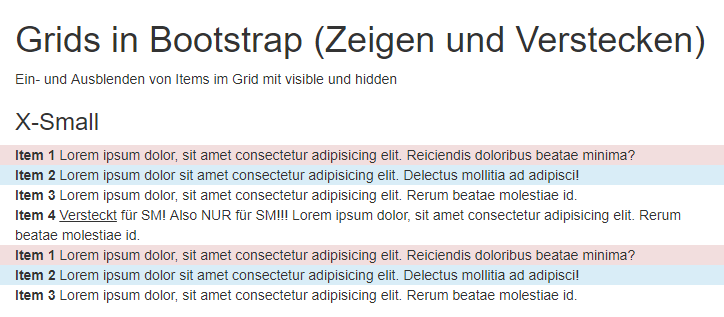
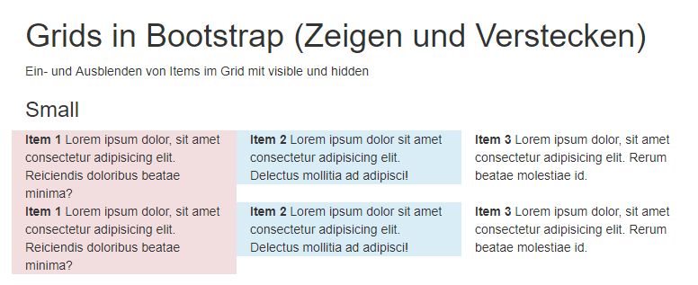
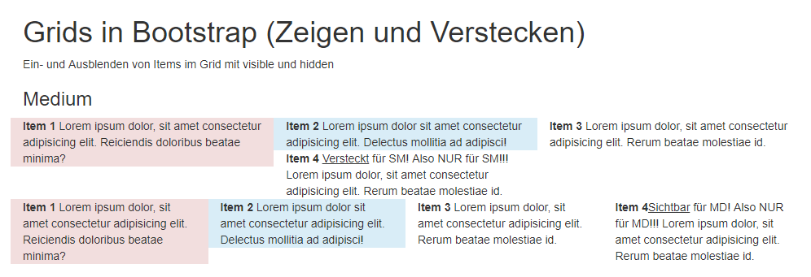
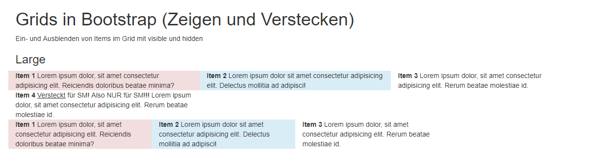

###  3.7. <a name='Panels'></a>Panels
- https://www.w3schools.com/bootstrap/bootstrap_panels.asp
- https://mdbootstrap.com/docs/jquery/components/panels/

Aufruf der vordefinierten bootstrap.css-Datei über HTML
```html
<!DOCTYPE html>
<html lang="en">

<head>
    <meta charset="UTF-8">
    <meta name="viewport" content="width=device-width, initial-scale=1.0">
    <meta http-equiv="X-UA-Compatible" content="ie=edge">
    <title>Bootstrap: Panels</title>
    <link rel="stylesheet" href="node_modules/bootstrap/dist/css/bootstrap.css">
</head>

<body>
    <div class="container">
        <h1>Panels in Bootstrap</h1>
        <!-- Panel -->
        <div class="panel panel-default">
            <div class="panel-heading">
                <h2>Default Panel</h2>
            </div>
            <div class="panel-body">
                Ein Panel präsentiert Inhalte.
                Lorem ipsum dolor sit, amet consectetur adipisicing
                elit.</div>
            <div class="panel-footer">Das ist der Footer...</div>
        </div>

        <!-- Umfärben des Footers geht nicht: 
             .panel .panel-footer {
                 background-color:lightgrey;
             }
               // wirkt nicht!
              .bg-primary { 
                  color:white;
                  background-color: blue;
              }

            <div class="panel-footer bg-primary">...  </div>
        -->

        <div class="panel panel-primary">
            <div class="panel-heading">
                <h2>Primary Panel</h2>
            </div>
            <div class="panel-body">
                Ein Panel präsentiert Inhalte.
                Lorem ipsum dolor sit, amet consectetur adipisicing
                elit.</div>
            <div class="panel-footer">Das ist der Footer...</div>
        </div>

        <div class="panel panel-success">
            <div class="panel-heading">
                <h2>Success Panel</h2>
            </div>
            <div class="panel-body">
                Ein Panel präsentiert Inhalte.
                Lorem ipsum dolor sit, amet consectetur adipisicing
                elit.</div>
            <div class="panel-footer">Das ist der Footer...</div>
        </div>
    </div>
</body>

</html>
```

Vorschau  
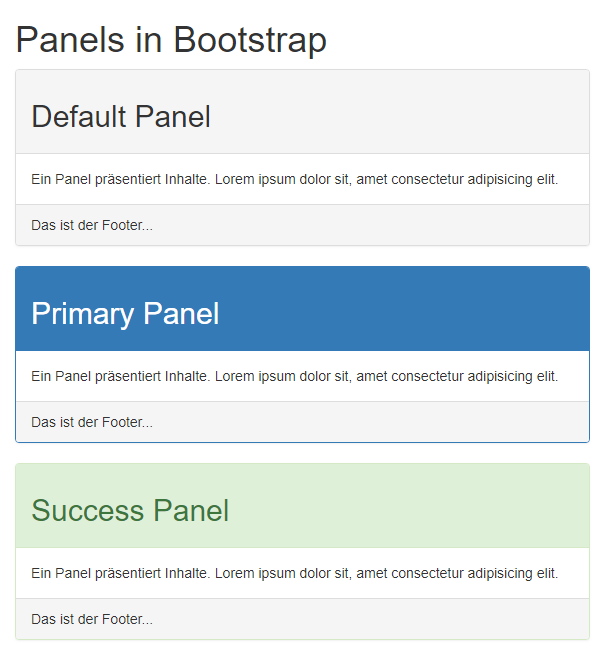

###  3.8. <a name='ButtonsFormulare'></a>Buttons & Formulare
- https://www.w3schools.com/bootstrap/bootstrap_buttons.asp
- https://getbootstrap.com/docs/4.0/components/buttons/

Aufruf der vordefinierten bootstrap.css-Datei über HTML
```html
<!DOCTYPE html>
<html lang="en">

<head>
    <meta charset="UTF-8">
    <meta name="viewport" content="width=device-width, initial-scale=1.0">
    <meta http-equiv="X-UA-Compatible" content="ie=edge">
    <title>Bootstrap: Buttons</title>
    <link rel="stylesheet" href="node_modules/bootstrap/dist/css/bootstrap.css">
</head>

<body>
    <div class="container">
        <h1>Buttons in Bootstrap</h1>
        <div class="row">
            <div class="col-xs-4">
                <button class="btn btn-default">Default-Button</button>
                <button class="btn btn-primary">Primary-Button</button>
                <button class="btn btn-success">Success-Button</button>
                <button class="btn btn-info">Info-Button</button>
                <button class="btn btn-warning">Warning-Button</button>
                <button class="btn btn-danger">Danger-Button</button>
            </div>
            <div class="col-xs-4">
                <button class="btn btn-default">Default-Button</button>
                <input class="btn btn-default" type="button" value="Input-Button">
                <a class="btn btn-default" href="">Anker-Button</a>
            </div>
            <div class="col-xs-4">
                <button class="btn btn-primary btn-sm">Primary-Small</button>
                <button class="btn btn-primary">Primary-Button</button>
                <button class="btn btn-primary btn-lg">Primary-Large</button>
            </div>
        </div>
        <h1>Formulare</h1>
        <p>Formulare müssen die class="form" erhalten.</p>
        <form action="#" class="form">

            <div class="form-group">
                <label for="usr">User</label>
                <input class="form-control" type="text" id="usr" name="user">
            </div>
            <div class="form-group">
                <label for="pw">Passwort</label>
                <input class="form-control" type="text" id="pw" name="user">
            </div>
            <div class="form-group"></div>
            <!-- Buttons NICHT als form-control! -->
            <input class="btn btn-primary" type="submit" value="Abschicken">
    </div>
    </form>
    </div>
</body>

</html>
```

Vorschau  
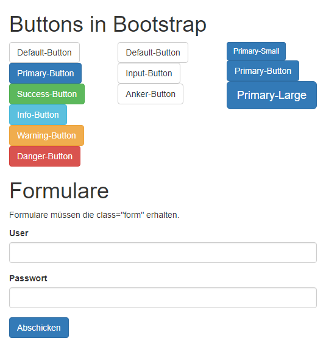

###  3.9. <a name='Formulare'></a>Formulare
- https://www.bootstrapworld.de/formular.html
- https://getbootstrap.com/docs/4.0/components/forms/

Aufruf der vordefinierten bootstrap.css-Datei über HTML
```html
<!DOCTYPE html>
<html lang="en">

<head>
    <meta charset="UTF-8">
    <meta name="viewport" content="width=device-width, initial-scale=1.0">
    <meta http-equiv="X-UA-Compatible" content="ie=edge">
    <title>Bootstrap: Formulare</title>
    <link rel="stylesheet" href="node_modules/bootstrap/dist/css/bootstrap.css">
</head>

<body>
    <div class="container">
        <h1>Formulare</h1>
        <p>Formulare müssen die class="form" erhalten. Sind linear angeordnet.</p>
        <form action="#" class="form">

            <div class="form-group">
                <label for="usr">User</label>
                <input class="form-control" type="text" id="usr" name="user">
            </div>
            <div class="form-group">
                <label for="pw">Passwort</label>
                <input class="form-control" type="text" id="pw" name="user">
            </div>
            <div class="form-group">
                <!-- Buttons NICHT als form-control! -->
                <input class="btn btn-primary" type="submit" value="Abschicken">
            </div>
        </form>
        <p>Es gibt eine Variante: class="form-horizontal". HTML muss erheblich umgebaut werden.</p>
        <form action="#" class="form-horizontal">

            <div class="form-group">
                <label for="usr" class="col-sm-2">User</label>
                <div class="col-sm-10">
                    <input class="form-control" type="text" id="usr" name="user">
                </div>
            </div>
            <div class="form-group">
                <label for="pw" class="col-sm-2">Passwort</label>
                <div class="col-sm-10">
                    <input class="form-control" type="text" id="pw" name="user">
                </div>

            </div>
            <div class="form-group">
                <!-- Buttons NICHT als form-control! -->
                <div class="col-sm-10 col-sm-push-2">
                    <input class="btn btn-primary" type="submit" value="Abschicken">
                </div>
            </div>
        </form>
        <p>Kleine Formulare als "form-inline"</p>
        <form action="#" class="form-inline">
            <div class="form-group">
                <label for="s">Suche:</label>
                <input type="text" class="form-control">
            </div>
            <input type="button" class="btn btn-success" value="Suche">
        </form>
    </div>
</body>

</html>
```

Vorschau  
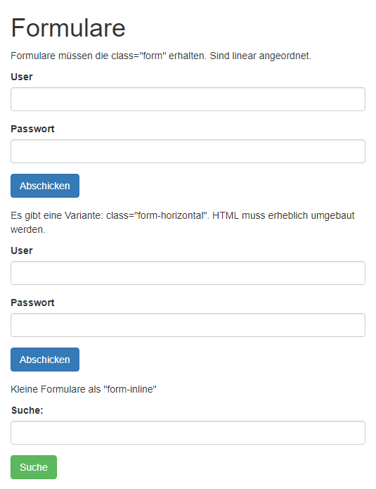

###  3.10. <a name='Navigationen'></a>Navigationen
- https://getbootstrap.com/docs/4.0/components/navbar/
- https://getbootstrap.com/docs/4.0/components/navs/
- https://bootsnipp.com/tags/navigation

Aufruf der vordefinierten bootstrap.css-Datei über HTML
```html
<!DOCTYPE html>
<html lang="en">

<head>
    <meta charset="UTF-8">
    <meta name="viewport" content="width=device-width, initial-scale=1.0">
    <meta http-equiv="X-UA-Compatible" content="ie=edge">
    <title>Bootstrap: Navigationen</title>
    <link rel="stylesheet" href="node_modules/bootstrap/dist/css/bootstrap.css">
</head>

<body>
    <div class="container">
        <h1>Navigationen</h1>
        <p>Eine Navigation hat die Basisklasse "nav".
            Hier mit dem Modifier "nav-pills". Das zweite Item ist "active".
        </p>
        <!-- ul>li*4>a{Test} -->
        <ul class="nav nav-pills">
            <li><a href="">Test</a></li>
            <li class="active"><a href="">Test</a></li>
            <li><a href="">Test</a></li>
            <li><a href="">Test</a></li>
        </ul>
        <p>Eine Navigation hat die Basisklasse "nav".
            Hier mit dem Modifier "nav-tabs". Das zweite Item ist "active".
        </p>
        <!-- ul>li*4>a{Test} -->
        <ul class="nav nav-tabs">
            <li><a href="">Test</a></li>
            <li class="active"><a href="">Test</a></li>
            <li><a href="">Test</a></li>
            <li><a href="">Test</a></li>
        </ul>
    </div>
</body>

</html>
```

Vorschau  
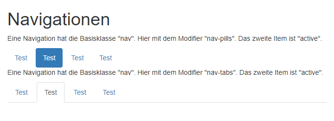

###  3.11. <a name='Collapsible'></a>Collapsible
- https://getbootstrap.com/docs/4.1/components/collapse/
- https://www.w3schools.com/bootstrap/bootstrap_collapse.asp
- [jQuery Installation](#jQueryInstallation)

Aufruf der vordefinierten bootstrap.css-Datei über HTML
```html
<!DOCTYPE html>
<html lang="en">

<head>
    <meta charset="UTF-8">
    <meta name="viewport" content="width=device-width, initial-scale=1.0">
    <meta http-equiv="X-UA-Compatible" content="ie=edge">
    <title>Bootstrap: Collapsible</title>
    <link rel="stylesheet" href="node_modules/bootstrap/dist/css/bootstrap.css">
</head>

<body>
    <div class="container">
        <h1>Collapsible</h1>
        <p>
            <a href="#myCollapser1" data-toggle="collapse" class="btn">Collapser 1</a>

            <button class="btn btn-default" data-target="#myCollapser2" 
            data-toggle="collapse">Collapser 2</button>
        </p>
        <div id="myCollapser1" class="collapse bg-success">
            <h3>Collapser 1</h3>
            <p>Lorem, ipsum dolor sit amet consectetur adipisicing elit.
                Ex voluptatum laborum eligendi modi sit
                aperiam!</p>
        </div>
        <div id="myCollapser2" class="collapse bg-info">
            <h3>Collapser 2</h3>
            <p>Lorem, ipsum dolor sit amet consectetur adipisicing elit.
                Ex voluptatum laborum eligendi modi sit
                aperiam!</p>
        </div>
        <p>Ein Collapser ist ein Container, der ausgeblendet ist, aber bei Bedarf...</p>
    </div>
    <script src="node_modules/jquery/dist/jquery.js"></script>
    <script src="node_modules/bootstrap/dist/js/bootstrap.js"></script>
</body>

</html>
```

Vorschau (Alles collapsed)  
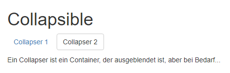

Vorschau (Collapser 1 aufgeklappt)  
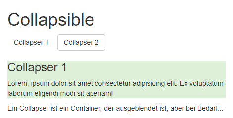

Vorschau (Collapers 1 & 2 aufgeklappt)  
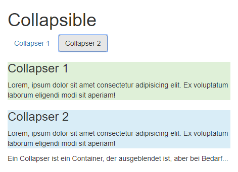